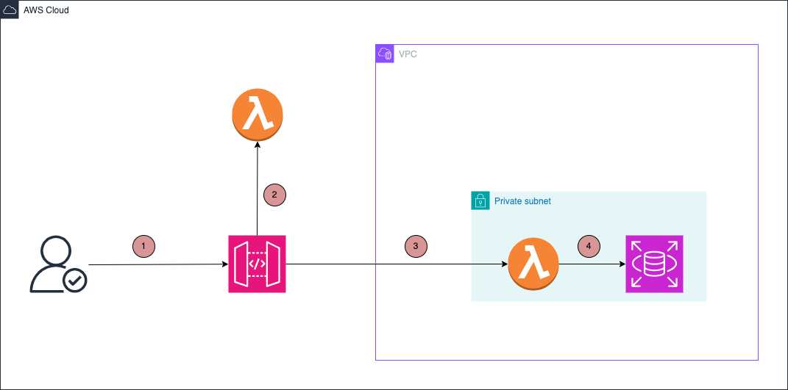

# AWS Aurora PostgreSQL pgvector Extension Creator

This CDK TypeScript project automates the deployment of pgvector extension on Amazon Aurora PostgreSQL instances, enabling vector similarity search capabilities.

## Project Overview

This project provides an infrastructure-as-code solution to automatically install and configure the pgvector extension on Aurora PostgreSQL databases. It includes secure API endpoints for managing the extension and follows AWS best practices for security and scalability.

Architecture:



1. The Admin user makes a request to the API Gateway endpoint to install the PNG vector extension with API key authentication
2. The API Gateway with Lambda authorizer is used to authenticate the request and authorize the user
3. If the request is authorized, the Lambda function is used to install the pgvector extension on the Aurora PostgreSQL database. This lambda function needs to be deployed to the VPC of the Aurora PostgreSQL instance.
4. The Lambda function will run the script to install the pgvector extension on the Aurora PostgreSQL database.

## Features
- Idempotent extension installation with transactional locking
- Automated pgvector extension installation on Aurora PostgreSQL
- Secure API endpoint with Lambda authorizer
- KMS encryption for sensitive data
- Cross-Origin Resource Sharing (CORS) support
- VPC-aware Lambda functions
- Automated secret rotation
- CloudWatch logging integration
- Infrastructure-as-Code with AWS CDK

## Prerequisites

- Node.js (v18 or later)
- AWS CDK CLI (v2.x)
- AWS CLI configured with appropriate credentials
- Python 3.13 (for Lambda functions)
- An existing Aurora PostgreSQL cluster
- VPC with private subnets (same as Aurora cluster)

## Project Setup

1. Clone the repository
2. Install dependencies:

```bash
npm install
```

3. Configure environment variables by creating a `.env` file:

I assumed that you deployed [VPC](https://github.com/OpenWorkspace-o1/aws-vpc) and [Aurora PostgreSQL](https://github.com/OpenWorkspace-o1/aws-aurora-serverless) stacks to get the some of the following values:

```env
# Application Configuration
APP_NAME=your-aurora-pgvector-serverless
CDK_DEPLOY_REGION=eu-west-1
ENVIRONMENT=development
OWNER=your-team-name

# API Configuration
API_AUTHORIZATION_SECRET_KEY=your-secret-key
ALLOW_ORIGINS=*

# Aurora PostgreSQL Configuration
RDS_USERNAME=postgres
RDS_PASSWORD=your_db_password
RDS_DATABASE_NAME=postgres
RDS_PORT=5432
RDS_HOST=your-aurora-cluster-endpoint
RDS_SECURITY_GROUP_ID=sg-xxxxxxxx

# VPC Configuration
VPC_ID=vpc-xxxxxxxx
VPC_SUBNET_TYPE=PRIVATE_WITH_EGRESS  # or PRIVATE_ISOLATED

# Subnet Configuration
VPC_PRIVATE_SUBNET_IDS=subnet-xxx1,subnet-xxx2,subnet-xxx3
VPC_PRIVATE_SUBNET_AZS=eu-west-1a,eu-west-1b,eu-west-1c
VPC_PRIVATE_SUBNET_ROUTE_TABLE_IDS=rtb-xxx1,rtb-xxx2,rtb-xxx3

# Lambda Configuration
ARCHITECTURE=ARM_64  # or X86_64
```

4. Update the stack configuration with your Aurora PostgreSQL details:
   - Database credentials
   - VPC configuration (must match Aurora cluster's VPC)
   - Subnet information
   - Security group settings

## Deployment

Deploy the stack to your AWS account:

```bash
npm run build
npx cdk deploy
```

Common CDK commands:

- `npm run build`   compile typescript to js
- `npm run watch`   watch for changes and compile
- `npm run test`    perform the jest unit tests
- `npx cdk deploy`  deploy this stack to your default AWS account/region
- `npx cdk diff`    compare deployed stack with current state
- `npx cdk synth`   emits the synthesized CloudFormation template

## Output

After successful deployment, the stack will output:

- API Gateway endpoint URL for managing the pgvector extension
- API endpoint requires authentication via the `Authorization` header with the configured secret key

Example usage:
```bash
curl -X POST \
  -H "Authorization: your-secret-key" \
  https://<api-gateway-endpoint>/activate
```

## Security

- **Secrets Management**:
  - Database credentials injected via encrypted Lambda environment variables
  - API keys stored in Secrets Manager with KMS encryption
- **Network Security**:
  - Lambda functions deployed in private subnets
  - Security group rules restrict database access to Lambda only
  - All database traffic stays within the VPC
- **Cryptography**:
  - KMS keys with automatic rotation (90 days)
  - TLS-encrypted database connections
- Automatic secret rotation enabled
